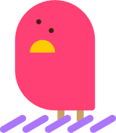

<!-- Improved compatibility of back to top link: See: https://github.com/othneildrew/Best-README-Template/pull/73 -->
<a id="readme-top"></a>
<!--
*** Thanks for checking out the Best-README-Template. If you have a suggestion
*** that would make this better, please fork the repo and create a pull request
*** or simply open an issue with the tag "enhancement".
*** Don't forget to give the project a star!
*** Thanks again! Now go create something AMAZING! :D
-->


<!-- PROJECT SHIELDS -->
<!--
*** I'm using markdown "reference style" links for readability.
*** Reference links are enclosed in brackets [ ] instead of parentheses ( ).
*** See the bottom of this document for the declaration of the reference variables
*** for contributors-url, forks-url, etc. This is an optional, concise syntax you may use.
*** https://www.markdownguide.org/basic-syntax/#reference-style-links
-->

<!-- [![Contributors][contributors-shield]][contributors-url]
[![Forks][forks-shield]][forks-url]
[![Stargazers][stars-shield]][stars-url]
[![Issues][issues-shield]][issues-url]
[![project_license][license-shield]][license-url] -->


<!-- PROJECT LOGO -->
<br />
<div align="center">
  <a href="https://github.com/github_username/repo_name">
    
  </a>

<h1 align="center">둥지동지</h1>

  <p align="center">
    🖼️ 한 장의 이미지로 룸메이트 구하기!
    <br />
    <a href="https://ebee1205.github.io/DungDong/"><strong>둥지동지 바로가기</strong></a>
    <br />
    <br />
    <a href="https://github.com/github_username/repo_name">View Demo</a>
    &middot;
    <a href="https://github.com/github_username/repo_name/issues/new?labels=bug&template=bug-report---.md">Report Bug</a>
    &middot;
    <a href="https://github.com/github_username/repo_name/issues/new?labels=enhancement&template=feature-request---.md">Request Feature</a>
  </p>
</div>


<!-- 프로젝트 소개 -->
## 프로젝트 소개

[![Product Name Screen Shot][product-screenshot]](https://example.com)

둥지동지는 중앙대학교 다빈치 캠퍼스의 학우들이 룸메이트를 빠르고 편하게 구할 수 있도록 기획한 프로젝트입니다.<br>
자신의 기숙사 생활에 대한 설문 결과를 한 장의 이미지로 출력하여 공유할 수 있는 편의기능을 제공하고 있습니다.

<p align="right">(<a href="#readme-top">back to top</a>)</p>


### 🚀 현재 제공 기능
- **기숙사 룸메이트 구인 설문 제공**  
  사용자가 설문을 통해 자신의 선호사항을 입력할 수 있습니다.
- **설문 결과 기반 타이틀 생성**  
  입력된 응답을 바탕으로 사용자의 소개 제목을 자동으로 작성해 줍니다.
- **최종 결과 이미지 생성 및 다운로드 지원**  
  1000×1000px 크기의 결과 이미지를 생성하여 다운로드할 수 있습니다.

<p align="right">(<a href="#readme-top">back to top</a>)</p>


### 😎 함께한 사람들
둥지동지를 제작한 <칸타르동방구함위원회> 입니다. 저희는 중앙대 예술공학부의 동아리 [칸타르](https://www.instagram.com/cau_cantar/)에 기반을 두고있습니다.


|  |  |  |  |
|--------|------|-------|------|
|  | 조은비 | `최초 기획` `프론트 개발` | [github](https://github.com/Ebee1205) [블로그](https://wavicle.tistory.com/) |
|  | 백지오 | `UX/UI 디자인` `편집 디자인` | [github](URL) [포트폴리오](https://sites.google.com/view/jiographic) |
|  | 고예경 | `QA` `UX 개선` `기획안 개선` | [github](https://github.com/jio311) [블로그](URL) |
|  | 황준호 | `데이터 분석 및 통계` | [github](URL) [블로그](URL) |

그리고 <둥지동지> 이름을 지어준 김태희씨, 제작에 힘이 되어준 칸타르 친구들에게 감사인사를 드립니다.

<p align="right">(<a href="#readme-top">back to top</a>)</p>


### 📚 기술 스택

[![Vue][Vue.js]][Vue-url] [![Vuetify][Vuetify]][Vuetify-url] 
[![Firebase][Firebase]][Firebase-url]
[![Github Pages][Github Pages]][Github-Pages-url] 
[![Figma][Figma]][Figma-url] 

<p align="right">(<a href="#readme-top">back to top</a>)</p>


<!-- 시작하기 -->
## 시작하기

아래의 단계에 따라 프로젝트를 로컬에서 설정하고 실행할 수 있습니다.

### 사전 요구사항

이 프로젝트는 `Vuetify`와 `Vue.js`를 기반으로 하고 있습니다. 


### 설치

1. Firebase에서 API 키 발급 [https://firebase.google.com/docs/firestore](https://firebase.google.com/docs/firestore)
2. 레포 클론하기
   ```sh
   git clone https://github.com/Ebee1205/DungDong.git
   ```
3. NPM 패키지 설치
   ```sh
   npm install
   ```
4. `.env` 파일 생성 후 Firebase API 키 입력
   ```.env
   // .env file
   
    VITE_FIREBASE_API_KEY = 
    VITE_FIREBASE_AUTH_DOMAIN = 
    VITE_FIREBASE_PROJECT_ID = 
    VITE_FIREBASE_STORAGE_BUCKET = 
    VITE_FIREBASE_MESSAGING_SENDER_ID = 
    VITE_FIREBASE_APP_ID = 
    VITE_FIREBASE_MEASUREMENT_ID = 
   ```
<!-- 5. Change git remote url to avoid accidental pushes to base project
   ```sh
   git remote set-url origin github_username/repo_name
   git remote -v # confirm the changes
   ``` -->

<p align="right">(<a href="#readme-top">back to top</a>)</p>


<!-- 로드맵 -->
## 🛤️ 로드맵
### 🏗️ 예정된 기능 (순차적으로 추가 예정)
- **이어하기 기능 추가**  
  설문 진행 중이거나 완료된 결과를 저장하고 나중에 이어서 작업할 수 있도록 개선할 예정입니다.
- **관별 색상 차별화 적용**  
  기숙사 관(건물)별로 최종 결과 이미지의 색상을 다르게 적용하여 구별이 쉽도록 개선할 계획입니다.

추후 업데이트를 통해 더욱 직관적이고 편리한 기능을 제공할 예정입니다. 😊  
많은 관심 부탁드립니다! 🚀

### 업데이트 내역


### 제작기
- 📝 둥동 기획- 어쩌고저쩌고 [25년 2월 3일]
<!-- - 둥동 만들기 - 
- 둥동 만들기 -->

<p align="right">(<a href="#readme-top">back to top</a>)</p>


<!-- 레퍼런스 -->
## 레퍼런스
이 프로젝트는 아래의 프로젝트에서 영감을 받아 제작되었습니다.
* [썸네일 메이커](https://blog.wonkooklee.com/playground/thumbnail-maker/)
* [Receiptify](https://receiptify.herokuapp.com)

<p align="right">(<a href="#readme-top">back to top</a>)</p>


<!-- MARKDOWN LINKS & IMAGES -->
<!-- https://www.markdownguide.org/basic-syntax/#reference-style-links -->
[contributors-shield]: https://img.shields.io/github/contributors/github_username/repo_name.svg?style=for-the-badge
[contributors-url]: https://github.com/github_username/repo_name/graphs/contributors
[forks-shield]: https://img.shields.io/github/forks/github_username/repo_name.svg?style=for-the-badge
[forks-url]: https://github.com/github_username/repo_name/network/members
[stars-shield]: https://img.shields.io/github/stars/github_username/repo_name.svg?style=for-the-badge
[stars-url]: https://github.com/github_username/repo_name/stargazers
[issues-shield]: https://img.shields.io/github/issues/github_username/repo_name.svg?style=for-the-badge
[issues-url]: https://github.com/github_username/repo_name/issues
[license-shield]: https://img.shields.io/github/license/github_username/repo_name.svg?style=for-the-badge
[license-url]: https://github.com/github_username/repo_name/blob/master/LICENSE.txt

[product-screenshot]: images/screenshot.png

[Vue.js]: https://img.shields.io/badge/Vue.js-35495E?style=for-the-badge&logo=vuedotjs&logoColor=4FC08D
[Vue-url]: https://vuejs.org/
[Vuetify]: https://img.shields.io/badge/Vuetify-1867C0?style=for-the-badge&logo=vuetify&logoColor=AEDDFF
[Vuetify-url]: https://vuetifyjs.com/
[Figma]: https://img.shields.io/badge/figma-%23F24E1E.svg?style=for-the-badge&logo=figma&logoColor=white
[Figma-url]: https://www.figma.com/
[Firebase]: https://img.shields.io/badge/firebase-a08021?style=for-the-badge&logo=firebase&logoColor=ffcd34
[Firebase-url]: https://firebase.google.com/
[Github Pages]:https://img.shields.io/badge/github%20pages-121013?style=for-the-badge&logo=github&logoColor=white
[Github-Pages-url]: https://pages.github.com/